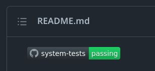

# CI/CD

The project uses Github Actions to run automated tests on pull requests and to deploy the app to "production".

In CI environment, tests are run against containerized application. See the `.github/workflows/system-tests.yaml` for details of the configuration. In CI a special test-runner container is pulled to run the robot tests in headless mode. This container was a quick side-project of this main assigment. It is possible to use the test-runner container locally as well. `test-results` folder should exist in the project root before running the tests.

The test-runner container only supports headless.

```sh
docker run --network="host" \
 --volume ./tests:/home/testrunner/tests \
 --volume ./test-results:/home/testrunner/test-results \
 juhanir/test-runner:0.1.2
```

The tests are run on every pull request made in from another branch in the source repository (not forks). Target is to always keep it green.


