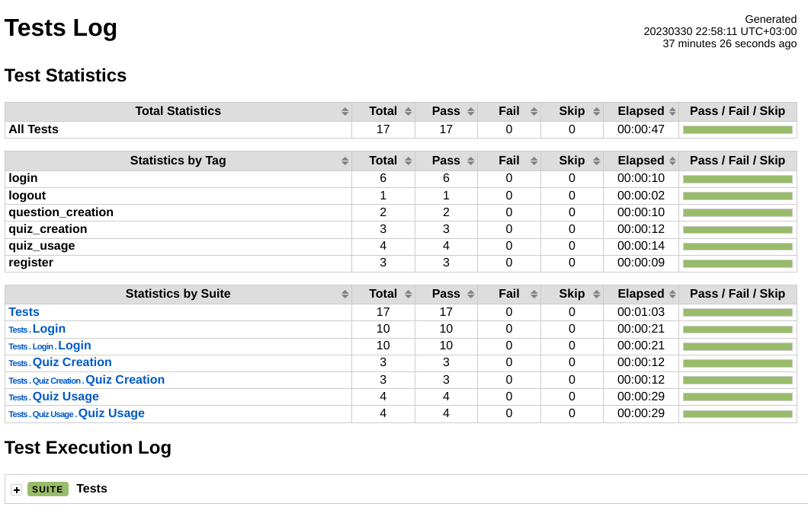

# Instructions for development

## Prerequisites

To get the project running locally, the easiest way is with Docker since that does not require any project-specific dependencies to be installed. To install and start the whole project with python, follow the section `Development dependencies`.

### Development dependencies

- Python v3.9+
- Create virtual environment with venv
- run `pip install -r requirements-dev.txt`
  <br>Note that `requirements.txt` is for production use and contains minimal dependencies.
- PostgreSQL command line tool `psql`.
- (Optional) Chrome browser
- (Optional) [Chromedriver](https://chromedriver.chromium.org/downloads) with matching version, needs to be in path.
- (Optional) Node.js v18+
  - If building styles, run `npm install` in the `tailwind` folder, then `invoke styles` at the project root. This builds css stylesheets to `src/static/css` folder. Any change to css utility classes will require a rebuild of the style sheets with `invoke styles` to take effect.

### Docker

- [Docker](https://docs.docker.com/get-docker/) and [docker compose](https://docs.docker.com/compose/install/)
- PostgreSQL command line tool `psql`.

## Starting the app

### Common steps

- First create a `.env` file to the project root with the following content
```
PG_PASSWORD=<some_pg_password>
DATABASE_URL=postgresql+psycopg2://postgres:<some_pg_password>@<host>:5432/quizdeveloper
SECRET_KEY=<cookie_signing_key>
```
- Variables to set in the env-file:
  - `<some_pg_password>`: Password to the postgres database
  - `<host>`: If using the docker-compose method, replace with **quizdb** otherwise use **localhost**
  - `<cookie_signing_key>`: Some secret key used to sign the cookie

### a) Docker

Run the following command in the project root, this starts the database and app.
```sh
docker compose up
```
Docker compose will pull the required images and set up the resources, logs will stream to the terminal window where it was started. App should become available at `localhost:5000`. To shut it down gracefully, open another terminal window and run
```sh
docker compose down
```

### b) Not Docker

Make sure your preferred installation of postgres is running and accessible at `localhost:5432`. Use the schema from `scripts/schema.sql` to initialize the database.

Db initialization could be done like this `psql -h localhost -p 5432 -U postgres < scripts/schema.sql`. This should be done before starting the app.

Then start the flask app from project root with
```sh
invoke dev
```

## Testing

This project uses Robot Framework to run system tests against the running application. The automated tests support only Chrome. You need to have Chrome browser and Chromedriver installed. To run the test suite locally use the following command.

```sh
invoke test

# optionally pass test tags
invoke test --include=some_tag_in_robot_files
```

If you want to see the stuff happening in the browser, comment out the headless option.

```python
# tests/Selenium.py
- self.options.add_argument('--headless')
+ # self.options.add_argument('--headless')
```

The test report is generated to `test-results` folder and when accessed in the browser will look something like this, where individual test cases can be expanded and reviewed at keyword level.


