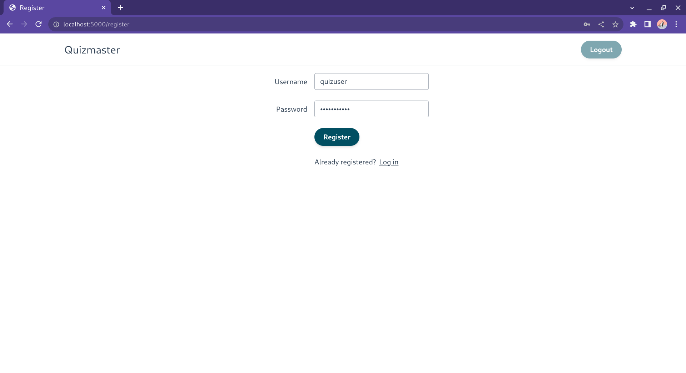
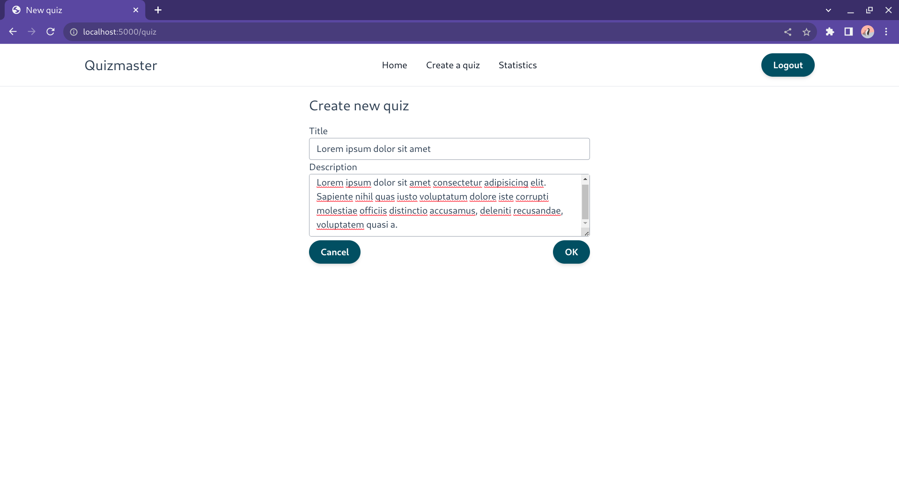
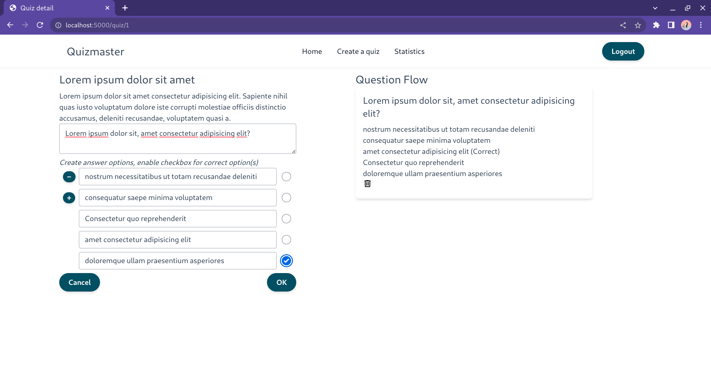
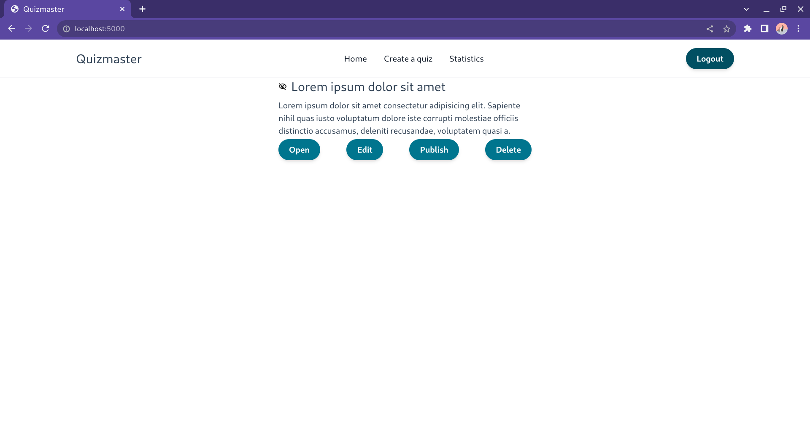
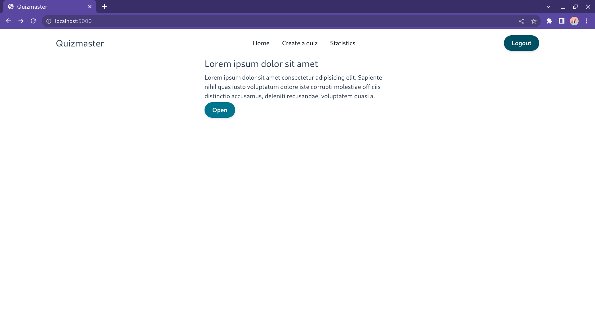
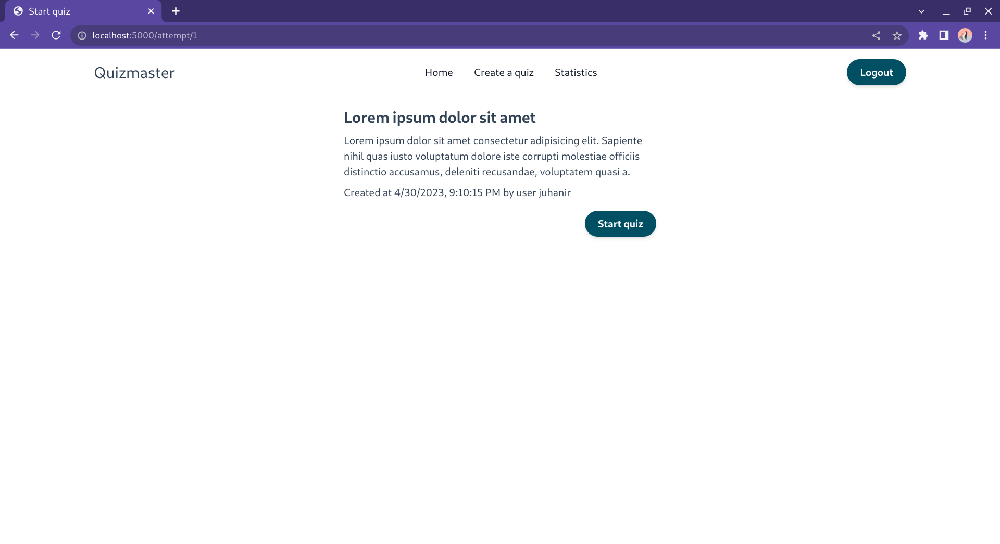
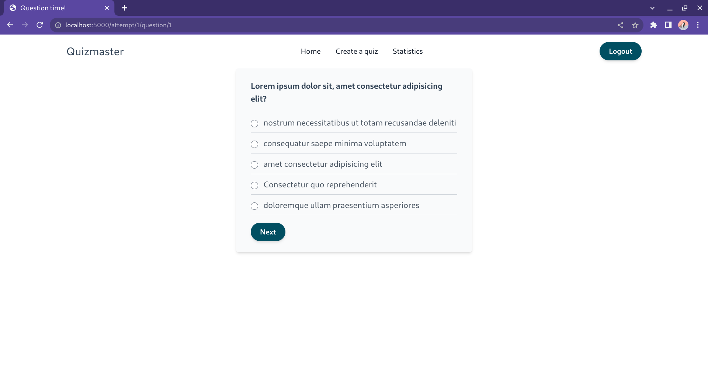
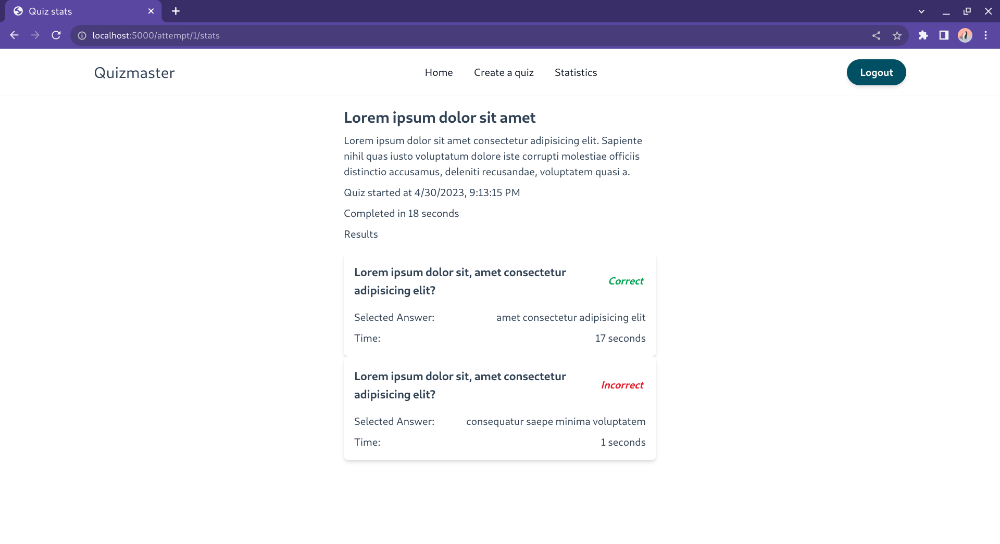
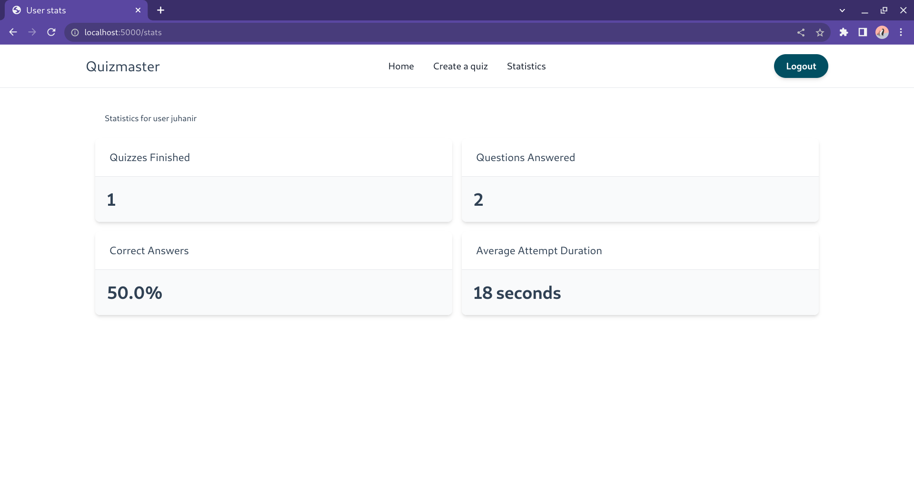

# Instructions

Here are the main functionalities of the application.

User signup and login

Quiz creation

In the question creation view, user can add questions to the quiz or delete them. Question flow shows the order of the questions, their answers and which answer is correct.

Unpublished quiz can be edited, tested or deleted. It cannot be viewed by other users than the author of the quiz.

Published quiz cannot be edited or deleted.

Opening the quiz shows quiz start page.

After starting the quiz user navigates through the questions.

After finishing the quiz user can see the results of that quiz instance.

Statistics about all of the users filled quizzes are in the statistics page.

### Todos

This is mainly to show progress below the main functionality level. These are not refined or prioritized, and serve mostly as a way to keep track of what details still need to be implemented.

  - create username and password DONE
  - log in DONE
  - unauthenticated user should be redirected to login page when trying to go to
    landing page DONE
  - there should be links between register and login <-> DONE
  - user should be able to logout DONE
  - create a new quiz DONE
  - after creating new question to quiz, question is listed and possible to add more DONE
  - see list of quizzes in the system on landingpage DONE
  - complete any quiz in the list DONE
    - Quiz in list is clickable DONE
    - Clicking quiz takes to "attempt quiz" view DONE
    - User can go through the quiz by selecting one answer out of answer options DONE
    - Main view of that page shows description of the quiz and allows to press start DONE
    - An answer should be made in order to go forward DONE
    - After selection the answer is locked for this attempt DONE
    - Final page should show stats about the completed quiz DONE
    - Final page should have link to go to main page DONE
    - Handle quiz with no questions DONE
  - answer can be defined correct (no limitation at first) DONE
  - deploy to fly.io or somewhere, integrate deployment to pipeline DONE
  - user existence should be checked from DB in login_required decorator DONE
  - integrate some style library DONE
  - save timestamps in ISO8601 format DONE
  - show timestamps in client local tz DONE
  - logout button disabled when user not logged in DONE
  - answers can be deleted, not just added DONE
  - possible to navigate away from quiz and question creation DONE
  - possible to edit existing quiz if not public DONE
  - publish a quiz or keep it private DONE
  - improve quiz creation in tests DONE
  - min and max length for inputs, both client and server side DONE
  - common error message logic DONE
  - possible to edit existing question along with its answers if not public in quiz DONE
  - delete a quiz that belongs to the user (note that quiz might be used while deleting) DONE
  - errorhandler with not found tpl DONE
  - deleting an unpublished quiz that has results should work DONE
  - show answer times at quiz stats page DONE
  - special stats page where user can see info about quizzes DONE
  - better UX at question creation DONE
  - quizzes, questions and answers have is_active property that is False when deleted DONE
    - enables deleting questions that are in private quizzes that have been answered already
  - unique constraint to connection tables based on compound key DONE
  - question flow in correct order DONE
  - fix CSRF vulnerability DONE
  - published quiz cannot be edited DONE
  - already created questions can be deleted DONE
  - more tests for users access to editing quizzes and seeing instance results DONE
  - notification of registering
  - change all urls to use url_for
  - check if should return Not Found or Forbidden or Bad Request for certain error scenarios
  - comb through all todos in the code
